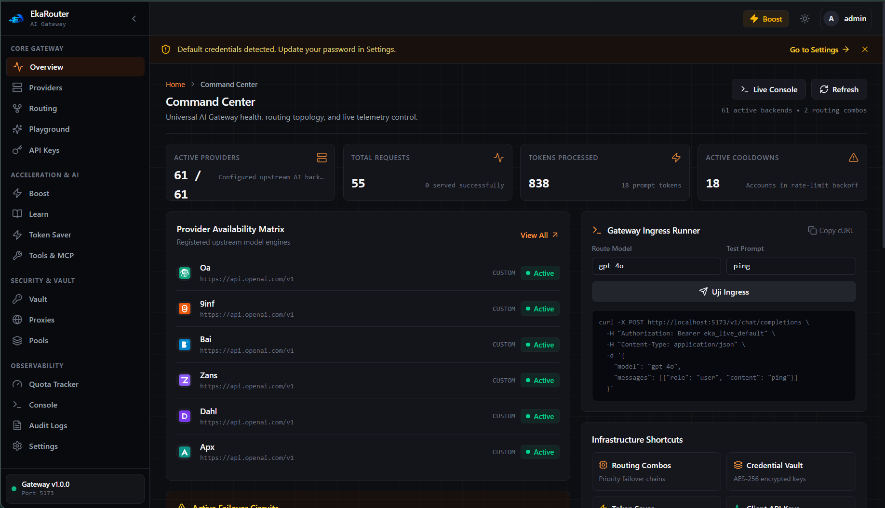
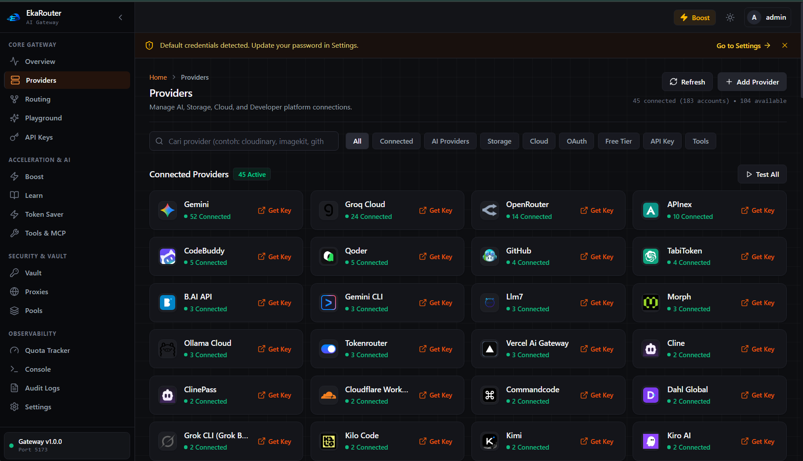
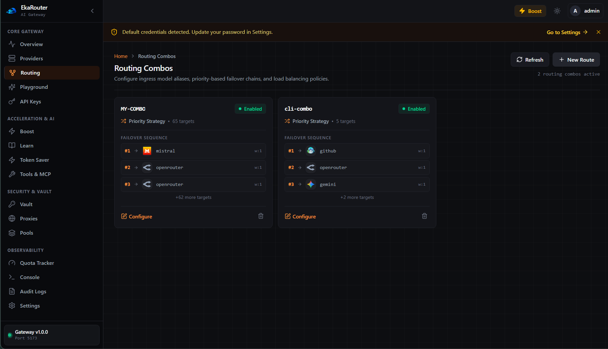
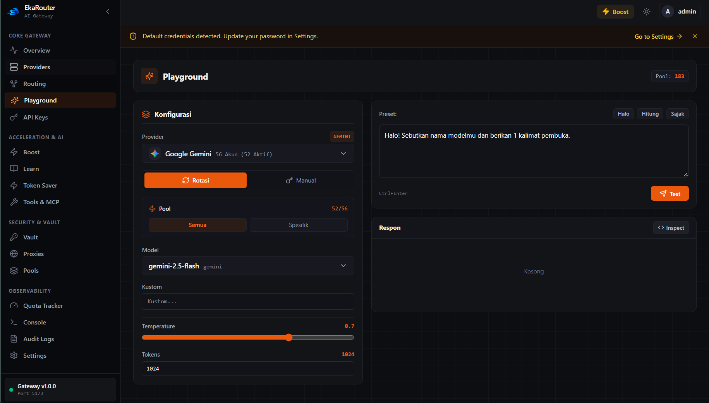
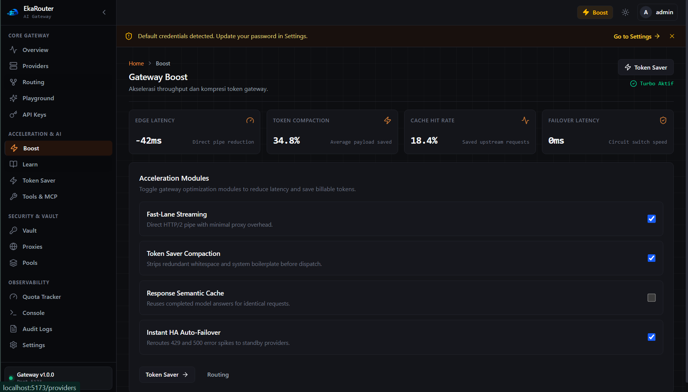
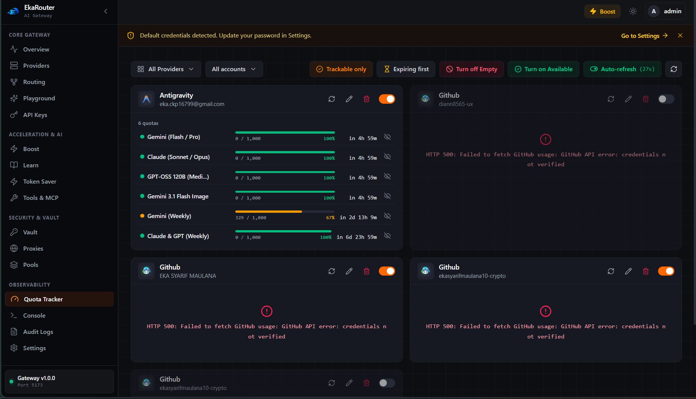
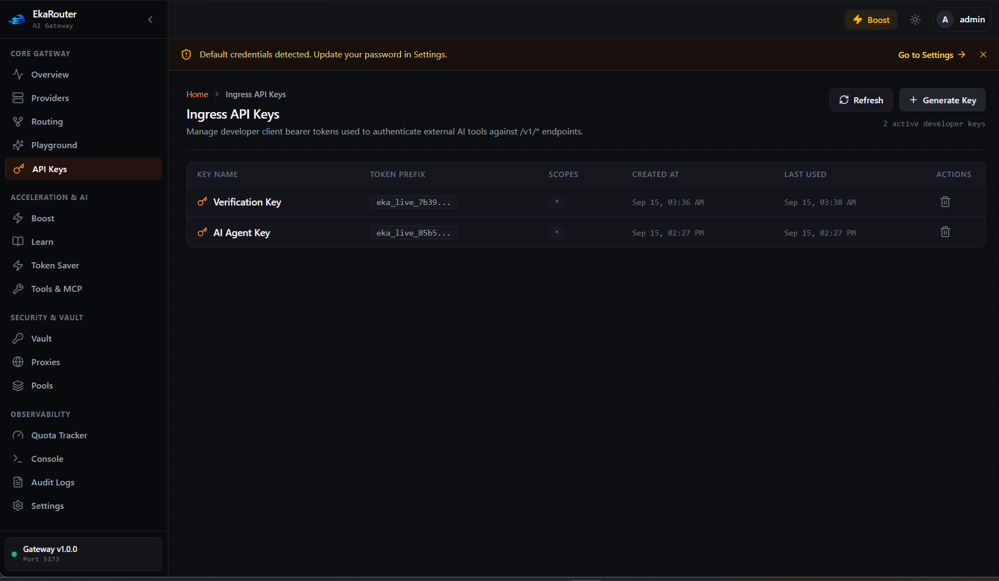

# EkaRouter

[](LICENSE)
[](https://golang.org/)
[](https://github.com/dresar/ekarouter)
[](CONTRIBUTING.md)

EkaRouter is an enterprise-grade, high-performance, lightweight, single-process **Universal AI Gateway & Developer API Management Platform** written in pure Go. It delivers OpenAI-compatible endpoints (`/v1/chat/completions`, `/v1/models`, `/v1/responses`) alongside a comprehensive Developer Platform (`/api/v1/*`) for managing third-party developer APIs, encrypted credential vaults, multi-strategy key rotation, rate limits, quotas, generic tool execution, webhooks, and SSRF-protected proxying.

Built with pure-Go SQLite (`modernc.org/sqlite`), EkaRouter is 100% CGO-free and compiles into a single, standalone executable on Windows, Linux, and macOS.

---

## UI Preview

<table>
  <tr>
    <td align="center" width="50%">
      
      <br/><sub><b>Command Center</b> — Live topology, 61 active backends, ingress runner</sub>
    </td>
    <td align="center" width="50%">
      
      <br/><sub><b>Providers</b> — 45 connected · 183 accounts · Gemini, Groq, OpenRouter and more</sub>
    </td>
  </tr>
  <tr>
    <td align="center" width="50%">
      
      <br/><sub><b>Routing Combos</b> — Priority failover chains, up to 65 cascaded targets</sub>
    </td>
    <td align="center" width="50%">
      
      <br/><sub><b>Playground</b> — Live model testing, pool rotation, 183 accounts</sub>
    </td>
  </tr>
  <tr>
    <td align="center" width="50%">
      
      <br/><sub><b>Gateway Boost</b> — 34.8% token savings, -42ms latency, instant HA failover</sub>
    </td>
    <td align="center" width="50%">
      
      <br/><sub><b>Quota Tracker</b> — Real-time per-account quota bars with reset countdowns</sub>
    </td>
  </tr>
  <tr>
    <td align="center" width="50%">
      
      <br/><sub><b>Ingress API Keys</b> — Developer PAT tokens for /v1/* endpoint access</sub>
    </td>
    <td align="center"></td>
  </tr>
</table>

---

## Key Features

### 1. Universal AI Gateway (`/v1/*`)
- **OpenAI-Compatible Drop-In**: Native streaming SSE completions for `/v1/chat/completions` and model discovery via `/v1/models`.
- **Multi-Provider Adapters**: Native translations for OpenAI, Anthropic Claude (`/v1/messages`), Google Gemini (`generateContent`), Cloudflare AI, Groq, Cerebras, OpenRouter, HuggingFace, Ollama, and custom backends.
- **Fail-Open Token Saver**: Heuristic prompt compaction (Git diffs, deduplicated logs, build output, truncation) preserving file paths, line numbers, and error traces.

### 2. Developer Platform & API Key Vault (`/api/v1/*`)
- **Encrypted Credential Vault**: Authenticated AES-256-GCM symmetric encryption with versioned ciphertext (`v1:<base64>`) and automatic secret masking (`sk-****abcd`, `ghp_****91xz`, `Bearer ****ef12`).
- **11 Universal Provider Categories**: Built-in discovery and adapters for Developer, Communication, Monitoring, Automation, Scraping & Data, Storage, Payments, Analytics, Maps, Security, and Custom APIs.
- **Multi-Strategy Key Rotation**: Concurrency-safe selection across Priority, Round Robin, Random, Least Used, Lowest Error Rate, and Health-Based strategies.
- **Rate Limit & Quota Engine**: Sliding-window rate limiting, persistent daily/monthly quota tracking, and automatic circuit-breaking cooldowns upon HTTP 429.
- **Generic Tool Execution Engine**: Parameterized HTTP tool caller with safe template variable substitution `{{var}}`, strict header injection/CRLF sanitization, and execution audit logging.
- **Strict SSRF Defense**: Rigorous blocking of loopback (`127.0.0.1`), link-local (`169.254.0.0/16`), RFC 1918 private IPv4 (`10.0.0.0/8`, `172.16.0.0/12`, `192.168.0.0/16`), and cloud metadata IP (`169.254.169.254`).
- **Webhooks System**: Inbound HMAC-SHA256 signature verification in constant time and outbound webhook event dispatching with delivery logging.
- **Controlled API Proxy**: Secure reverse proxy route `/api/v1/proxy/{provider}/*` injecting vault credentials and enforcing SSRF guards.
- **Role-Based Access Control**: Multi-tenant RBAC (`admin`, `developer`, `viewer`), PBKDF2-HMAC-SHA256 password hashing (100,000 rounds), and scoped developer client tokens (`eka_pat_*`).
- **Background Maintenance Scheduler**: Graceful background worker loop handling cooldown recovery, log retention pruning, and health verification.
- **Zero Source Comments**: Compliant with the strict `/nokomen` clean-code standard. All architectural documentation lives in Markdown.

---

## Project Structure

```text
ekarouter/
├── cmd/
│   └── ekarouter/       # Application entrypoint with flag parsing and signal traps
├── internal/
│   ├── app/             # Application dependency injection and graceful shutdown
│   ├── audit/           # Asynchronous immutable audit logger
│   ├── auth/            # AES-256-GCM crypto service and SHA-256 token hashing
│   ├── cli/             # Interactive terminal menu and management subcommands
│   ├── config/          # Environment variable configuration loader
│   ├── credpool/        # AI credential pool and rotation policies
│   ├── db/              # SQLite connection pool, WAL mode, and migrations
│   ├── devtools/        # OpenAPI 3.x document parser and template generator
│   ├── executor/        # Generic tool execution engine and template interpolation
│   ├── freetier/        # Free-tier provider catalog and capability seeding
│   ├── gateway/         # Core AI gateway pipeline, fallback, and SSE streaming
│   ├── health/          # Process liveness (/live, /health) and readiness (/ready) checks
│   ├── httpapi/         # Chi HTTP router, CORS/auth middleware, and API endpoints
│   ├── limits/          # Sliding-window rate limiter, quotas, and cooldowns
│   ├── oauth/           # Ephemeral PKCE OAuth state and token manager
│   ├── platform/        # Universal provider registry across 11 categories & SSRF guard
│   ├── providers/       # AI provider adapters (OpenAI, Anthropic, Gemini, etc.)
│   ├── proxy/           # Outbound HTTP transports and proxy chaining
│   ├── rbac/            # User authentication, PBKDF2 hashing, and client tokens
│   ├── rotator/         # Concurrency-safe multi-strategy credential selector
│   ├── routing/         # Combos, model alias resolution, and cooldown manager
│   ├── scheduler/       # Background periodic maintenance and log retention
│   ├── tokensaver/      # Heuristic text compaction algorithms
│   ├── usage/           # Non-blocking request and token usage logger
│   ├── vault/           # Encrypted credential vault, versioning, and masking
│   └── webhooks/        # HMAC-SHA256 signature verification and delivery dispatcher
├── migrations/          # Versioned SQL database migrations (0001, 0002, 0003)
├── scripts/             # Build scripts and smoke tests
└── docs/                # Comprehensive technical documentation suite
```

---

## Quick Start

### 1. Build Executable

```powershell
go build -ldflags="-s -w" -o ekarouter.exe ./cmd/ekarouter
```

### 2. Configure Environment

Copy `.env.example` to `.env`:
```powershell
Copy-Item .env.example .env
```

### 3. Run Server

```powershell
.\ekarouter.exe serve
```

EkaRouter binds to `http://0.0.0.0:8080` and initializes `data/ekarouter.db`.

### 4. Run Verification Tests

```powershell
go test ./...
```

---

## Documentation

Full architectural and developer guides are located in the `docs/` directory:
- [Audit Report](docs/developer-platform-audit.md)
- [System Architecture](docs/architecture.md)
- [Installation Guide](docs/installation.md)
- [Configuration Reference](docs/configuration.md)
- [Database Schema & Migrations](docs/database.md)
- [Security & SSRF Protection](docs/security.md)
- [Authentication](docs/authentication.md)
- [Authorization & RBAC](docs/authorization.md)
- [Provider Directory](docs/providers.md)
- [Provider Development Guide](docs/provider-development.md)
- [Credential Vault](docs/credentials.md)
- [API Keys & Client Tokens](docs/api-keys.md)
- [Credential Rotation Engine](docs/rotation.md)
- [Quotas & Limit Tracking](docs/quotas.md)
- [Rate Limiting & Cooldowns](docs/rate-limits.md)
- [Generic Tool Execution](docs/tools.md)
- [Custom Providers](docs/custom-providers.md)
- [OpenAPI 3.x Import](docs/openapi-import.md)
- [OAuth 2.0 Integration](docs/oauth.md)
- [Webhooks System](docs/webhooks.md)
- [Request Templates](docs/request-templates.md)
- [Controlled API Proxy](docs/proxy.md)
- [Usage Observability](docs/usage.md)
- [Audit Logging](docs/audit-logs.md)
- [Background Scheduler](docs/scheduler.md)
- [Testing Guide](docs/testing.md)
- [Build & Compilation](docs/build.md)
- [Production Deployment](docs/deployment.md)
- [Troubleshooting](docs/troubleshooting.md)

---

## Contributing

We welcome contributions from developers and AI agents alike! Please read [CONTRIBUTING.md](CONTRIBUTING.md) for a complete guide covering:

- Development environment setup
- Architecture overview and request lifecycle
- How to add a new AI provider adapter
- How to add a new platform provider
- Coding standards (zero comments / nokomen)
- Testing requirements and PR checklist
- **Dedicated section for AI agents** with critical rules, common patterns, and DB quick reference

[? Read CONTRIBUTING.md](CONTRIBUTING.md)

