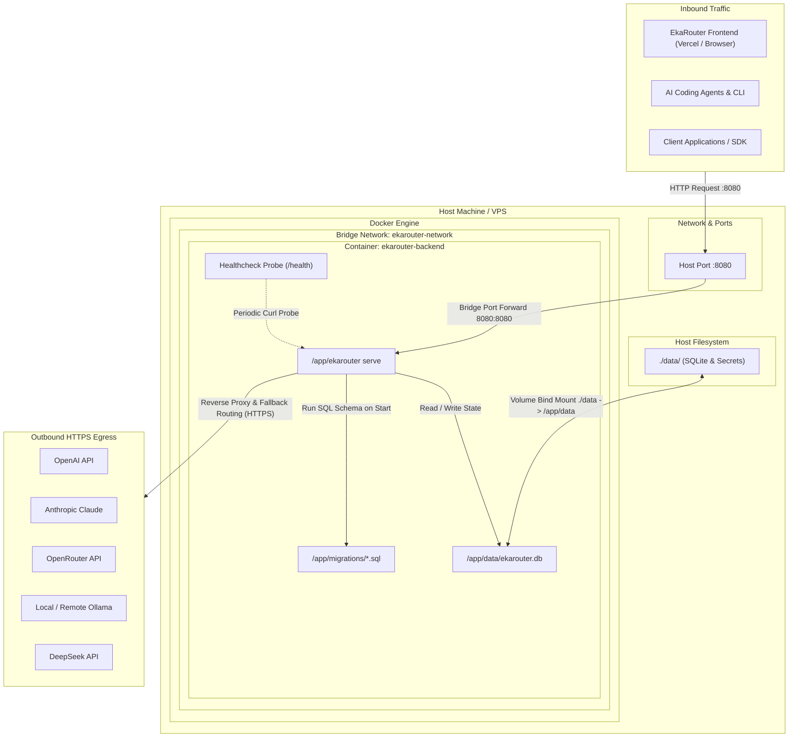

# EkaRouter Backend Docker Deployment Guide

Panduan instalasi, konfigurasi kontainer, dan arsitektur deployment Docker untuk EkaRouter Universal AI Gateway backend.

---

## 1. Diagram Konfigurasi & Arsitektur Docker



---

## 2. File Konfigurasi Docker

Struktur file deployment Docker pada root project:
- `Dockerfile` — Multi-stage build (Golang 1.24 Alpine builder -> Alpine 3.21 minimal runtime, non-root user `ekarouter:ekarouter`, static binary tanpa CGO).
- `docker-compose.yml` — Orkestrasi kontainer, mapping port `8080:8080`, persistent volume `./data:/app/data`, dan network bridge.
- `.dockerignore` — Menjaga image tetap ramping dengan mengecualikan file lokal, `.git`, dan folder `frontend`.

---

## 3. Langkah Instalasi & Menjalankan Kontainer

### Opsi A: Menggunakan Docker Compose (Direkomendasikan)

1. Jalankan build dan nyalakan kontainer di background:
   ```bash
   docker compose up -d --build
   ```

2. Periksa status kontainer:
   ```bash
   docker compose ps
   ```

3. Pantau log backend secara real-time:
   ```bash
   docker compose logs -f backend
   ```

4. Hentikan kontainer tanpa menghapus data:
   ```bash
   docker compose down
   ```

---

### Opsi B: Menggunakan Docker CLI Standalone

1. Build Docker image:
   ```bash
   docker build -t ekarouter:latest .
   ```

2. Jalankan kontainer dengan volume bind mount:
   ```bash
   docker run -d \
     --name ekarouter-backend \
     --restart unless-stopped \
     -p 8080:8080 \
     -v "$(pwd)/data:/app/data" \
     -e EKAROUTER_SECRET_KEY="isi_dengan_hex_secret_key_32_bytes" \
     -e EKAROUTER_ADMIN_USER="admin" \
     -e EKAROUTER_ADMIN_PASSWORD="admin_password_rahasia" \
     ekarouter:latest
   ```

---

## 4. Variabel Lingkungan (Environment Variables)

| Variabel | Default | Keterangan |
|---|---|---|
| `EKAROUTER_HOST` | `0.0.0.0` | Bind IP di dalam kontainer |
| `EKAROUTER_PORT` | `8080` | Port HTTP internal |
| `EKAROUTER_DB_PATH` | `/app/data/ekarouter.db` | Lokasi file database SQLite terenkripsi |
| `EKAROUTER_SECRET_KEY` | Hex 32 bytes | Kunci enkripsi AES-256 vault kredensial |
| `EKAROUTER_ADMIN_USER` | `admin` | Username akun administrator gateway |
| `EKAROUTER_ADMIN_PASSWORD` | `admin12345` | Password akun administrator gateway |
| `EKAROUTER_ALLOW_LOCAL_PROVIDERS` | `false` | Izinkan provider localhost (Ollama, LM Studio) |
| `EKAROUTER_TOKEN_SAVER_MODE` | `safe` | Mode kompresi prompt & semantic cache |
| `EKAROUTER_CORS_ORIGINS` | `*` | Domain yang diizinkan untuk akses CORS dari frontend |

---

## 5. Menjalankan Perintah CLI di Dalam Kontainer

Untuk menjalankan sub-perintah administratif EkaRouter (seperti backup, import, atau cek status):

```bash
# Menjalankan health check langsung
docker exec -it ekarouter-backend curl -f http://localhost:8080/health

# Mengecek versi binary
docker exec -it ekarouter-backend /app/ekarouter -version

# Melakukan backup database
docker exec -it ekarouter-backend /app/ekarouter -backup /app/data/manual-backup.json
```

---

## 6. Persistensi Data & Keamanan

1. **Volume Persistence**: Seluruh state (providers, models, routes, API keys, dan audit log) disimpan di file SQLite `/app/data/ekarouter.db`. Direktori host `./data` di-mount ke `/app/data`, sehingga data tetap utuh ketika kontainer di-restart atau di-upgrade.
2. **Non-Root User**: Kontainer berjalan di bawah user `ekarouter` (UID 10001), memitigasi risiko eskalasi hak akses pada host system.
3. **Static Binary**: Binary dikompilasi menggunakan `CGO_ENABLED=0` tanpa dependensi dinamis sistem operasi.
